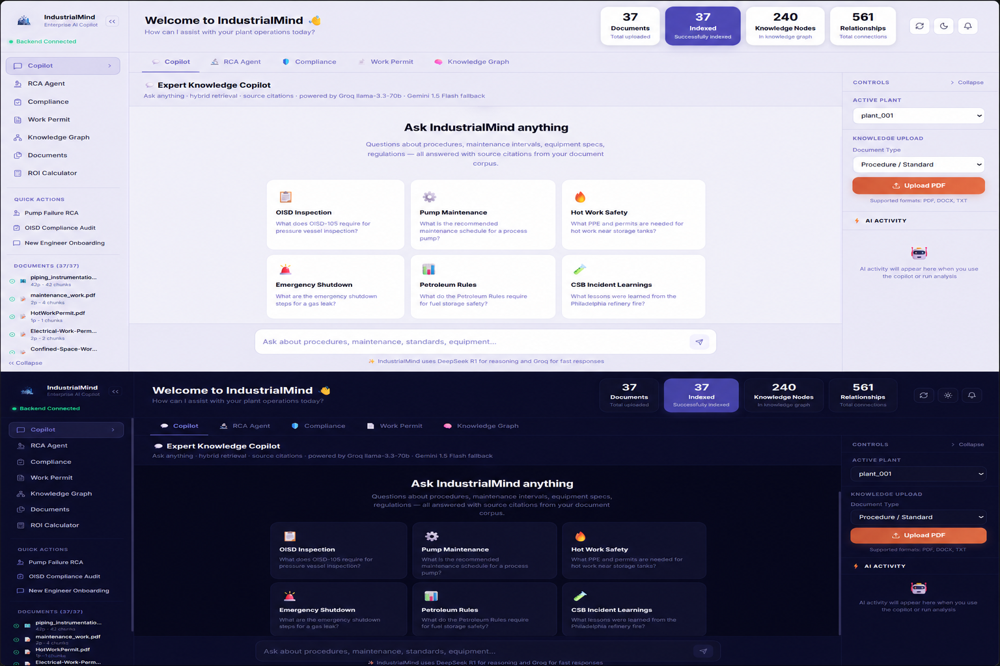
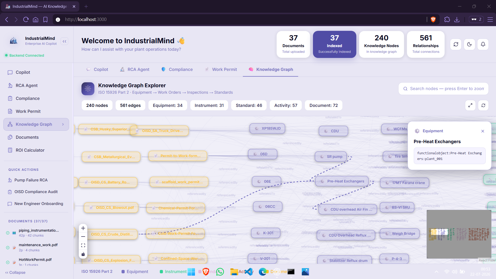
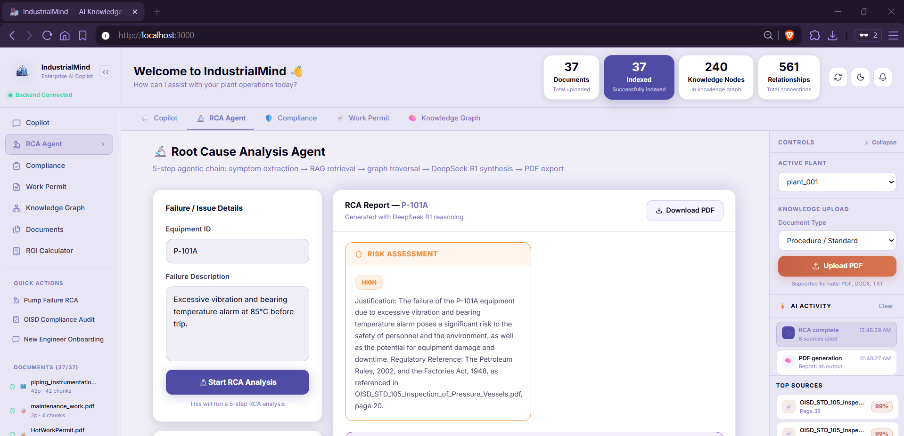
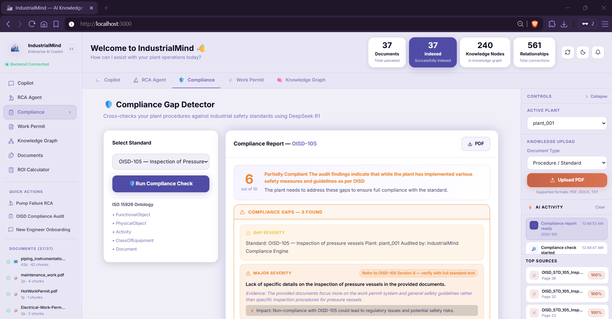
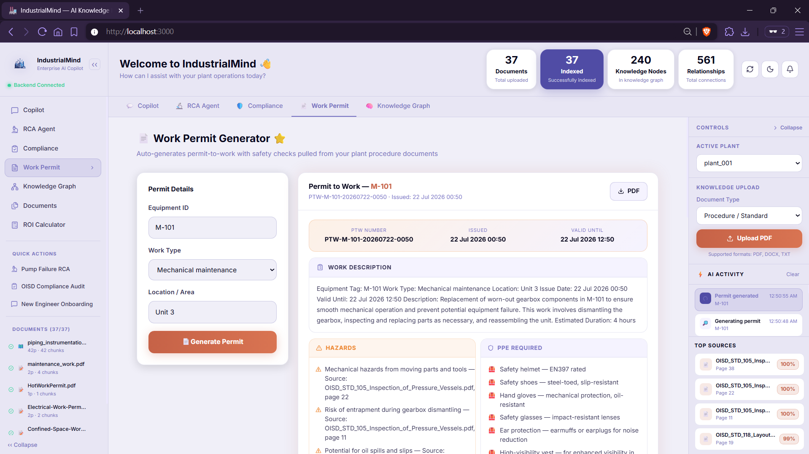

# 🏭 IndustrialMind

**AI-Powered Industrial Knowledge Intelligence Platform**

**ET AI Hackathon 2.0 — Phase 2 · Problem Statement 8**
*AI for Industrial Knowledge Intelligence (Unified Asset & Operations Brain)*



[](./EVALUATION.md)
[](./EVALUATION.md)
[](./EVALUATION.md)
[](./EVALUATION.md)

---

## 🎯 Overview

Industrial plants run on documents — OISD standards, OEM maintenance manuals, P&IDs, CSB incident reports, permit templates — scattered across shared drives, binders, and institutional memory. When something breaks or an audit is due, engineers spend hours hunting for the right paragraph in the right document.

**IndustrialMind turns that scattered document library into a single, queryable operations brain.** It ingests real industrial documents, builds a hybrid retrieval index and an ontology-backed knowledge graph over them, and exposes four purpose-built agents — Copilot, Root Cause Analysis, Compliance Gap Detection, and Work Permit Generation — all backed by a resilient, self-healing LLM pipeline.

**What it replaces**: a 30–45 minute manual document search.
**What it delivers**: a cited, structured answer in seconds.

**Live Demo**: `http://localhost:3000` (after running `start.bat` / `start.sh`)

---

## ✨ Key Features

| # | Feature | What it does |
|---|---|---|
| 1 | **Document Ingestion Pipeline** | Parses OISD standards, OEM manuals, CSB reports, P&IDs (via Groq Vision) into indexed, entity-tagged chunks — 37 documents, 159 chunks |
| 2 | **Expert Knowledge Copilot** | Hybrid RAG (ChromaDB + BM25 + Cohere Rerank v3) with session memory and page-level source citations |
| 3 | **Knowledge Graph Explorer** | ISO 15926 Part 2 ontology over 423 nodes / 1,399 edges, with an interactive React Flow visual explorer |
| 4 | **RCA Agent** | 5-step root cause chain — symptom extraction → multi-query RAG → graph traversal → synthesis → PDF export |
| 5 | **Compliance Gap Detector** | Checks against OISD-105/106/113/116/117/118/129, Factory Act, PESO, API 510/570, with a corpus-presence guard so it never audits against a standard that wasn't actually ingested |
| 6 | **Intelligent Work Permit Generator** | Generates a PTW PDF with live dates, LOTO steps, gas-testing requirements, a 10-item interactive checklist, and a permit closure section |
| 7 | **ROI Calculator** | Live sliders (engineers × rate × searches × time saved) showing ₹ monthly/annual savings |
| 8 | **Query Expansion Engine** | Incident-name expansion map (e.g. "Philadelphia" → the actual technical vocabulary in the source document), fixing historical-incident retrieval failures |
| 9 | **Smart Intent Router** | 4-way classifier that correctly separates live-equipment RCA queries from historical-incident lookups |
| 10 | **Structured Report Renderers** | Every agent output renders as a real UI component (5-Why chain, severity-badged gap cards, interactive checklists) — no raw markdown dumped into chat |

---

## 🏗️ Architecture

**Flow**: Document Ingestion → ChromaDB + BM25 + Knowledge Graph → Query Expander → Hybrid Retrieval → Agent Supervisor (4 agents) → 3-Tier LLM Fallback → React Frontend

Full breakdown, diagrams, and the prototype→production migration path: **[docs/ARCHITECTURE.md](./docs/ARCHITECTURE.md)**

### LLM Orchestration — 3-Tier Fallback

Every agent cascades through this chain automatically on rate limits or provider errors — the user only ever sees a clean message, never a raw error.

```
DeepSeek R1 (RCA/Compliance reasoning)
      ↓
Groq llama-3.3-70b (all agents, primary)
      ↓
Groq llama-3.1-8b-instant (fallback 1, separate quota)
      ↓
Gemini 1.5 Flash (fallback 2, 1,500 req/day free)
      ↓
Friendly error message (last resort)
```

---

## 🧱 Tech Stack

| Layer | Technologies |
|---|---|
| Frontend | Next.js, React, Tailwind, React Flow |
| Backend | FastAPI, Python, custom agent supervisor (no LangChain) |
| Retrieval | ChromaDB (vector), rank_bm25 (keyword), Cohere Rerank v3, custom query expansion engine |
| Knowledge Graph | NetworkX + ISO 15926 Part 2 ontology |
| LLMs | Groq (`llama-3.3-70b`, `llama-3.1-8b-instant`), DeepSeek R1, Google Gemini 1.5 Flash |
| Document Processing | LlamaParse, Unstructured, pdfplumber, Groq Vision (P&IDs) |
| Output | ReportLab (PDF generation) |
| Storage | SQLite + SQLAlchemy |
| Evaluation | RAGAS framework + custom precision/recall/coverage scripts |
| Local Deployment | `start.bat` / `start.sh` |

---

## 📊 Evaluation Results

Full methodology, per-question breakdown, and raw run output: **[EVALUATION.md](./EVALUATION.md)**

Evaluated on **37 ingested documents** using 20 hand-written ground-truth Q&A pairs, with a dedicated eval model (`llama-3.1-8b-instant`) kept separate from the primary inference model to avoid contamination.

| Metric | Score | Target | Status |
|---|---|---|---|
| Entity Extraction F1 | 0.912 | > 0.75 | ✅ |
| RAGAS Faithfulness | 0.989 | > 0.75 | ✅ |
| RAGAS Answer Relevancy | 0.889 | > 0.75 | ✅ |
| RAGAS Context Precision | 0.980 | > 0.70 | ✅ |
| Compliance Precision | 1.000 | > 0.80 | ✅ |
| Compliance Recall | 1.000 | > 0.75 | ✅ |
| Knowledge Graph Coverage | 100% | > 80% | ✅ |

All seven tracked metrics clear their targets, with faithfulness (0.989) the strongest result — indicating minimal hallucination against source documents.

---

## 🚀 Quick Start

**Windows**
```bat
git clone <your-repo-url>
cd industrialmind
./start.bat
```

**Linux / Mac**
```bash
git clone <your-repo-url>
cd industrialmind
./start.sh
```

**Access**
- Frontend: `http://localhost:3000`
- Backend: `http://127.0.0.1:8000`
- API Docs: `http://127.0.0.1:8000/docs`

**Requirements**
- Python 3.10+
- Node.js 18+
- `GROQ_API_KEY` set in `backend/.env`

---

## 🗺️ Roadmap: Prototype → Production

| Layer | Current | Production Target |
|---|---|---|
| Knowledge Graph | NetworkX, in-memory | Neo4j (persistent, queryable at scale) |
| Vector Store | ChromaDB, local | Pinecone / PGVector (managed cloud) |
| Ingestion | Batch document upload | Kafka-based real-time IoT/SCADA feed |
| Deployment | Local / Render | Docker + docker-compose, multi-tenant with RBAC |

The retrieval, agentic, and fallback layers are storage-agnostic by design, so each of these can be swapped independently without touching agent logic.

---

## 🖼️ Screenshots

| Dashboard | Knowledge Graph Explorer |
|---|---|
|  |  |

| RCA Output | Compliance Gap Detector |
|---|---|
|  |  |

| Work Permit Generator |
|---|
|  |

---

## 📦 Submission Deliverables

| Deliverable | Location |
|---|---|
| Detailed Document (8–10 pages) | `docs/IndustrialMind_Detailed_Document.pdf` |
| Demo Video (3–4 min) | *[link]* |
| Architecture Diagram | [docs/ARCHITECTURE.md](./docs/ARCHITECTURE.md) |
| Evaluation Report | [EVALUATION.md](./EVALUATION.md) |

---

## 📁 Repository Structure

```text
industrialmind/
├── backend/              # FastAPI + agent supervisor + hybrid RAG + KG
├── frontend/             # Next.js dashboard
├── docs/                 # Architecture diagrams + screenshots + detailed document
├── eval/                 # Evaluation scripts (run_eval.py) & results.json
├── start.bat / start.sh  # One-click local run
├── ARCHITECTURE.md
└── EVALUATION.md
```

---

<p align="center">Made with ❤️ for ET AI Hackathon 2.0</p>
