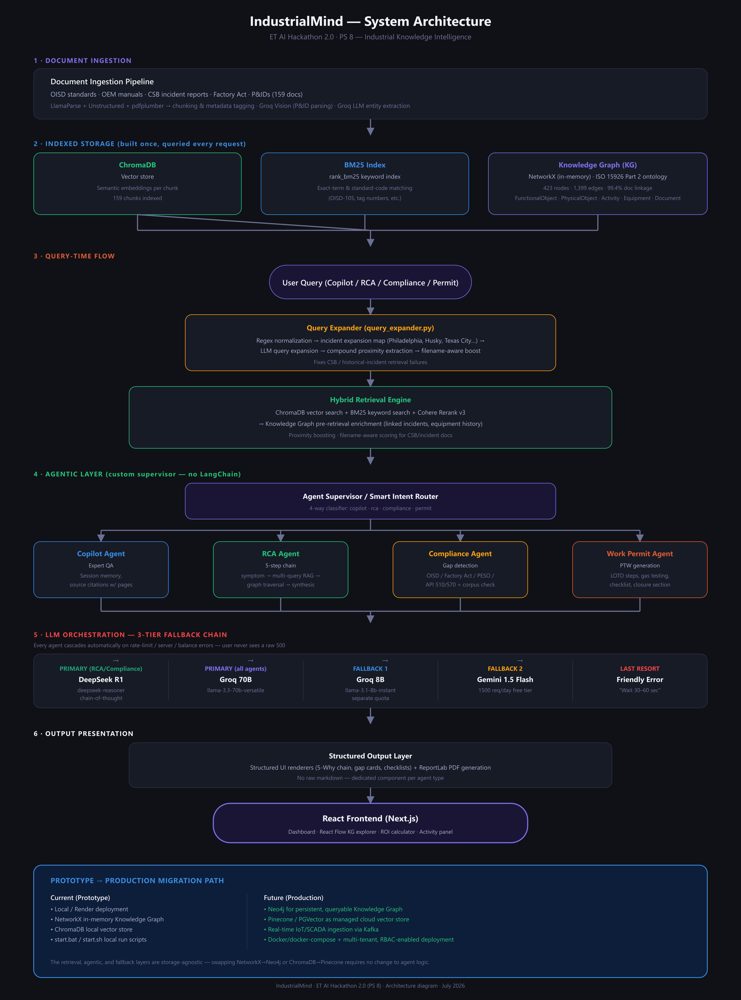
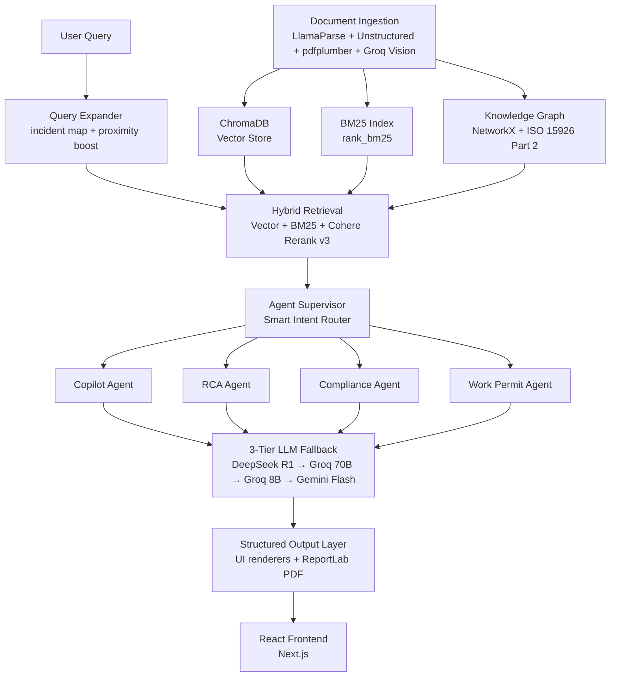

# IndustrialMind

**ET AI Hackathon 2.0 — PS 8: Industrial Knowledge Intelligence**
**Last Updated**: 22 July 2026

---

## Diagram

*(Full-resolution version: `docs/architecture-diagram.png`)*

A GitHub-renderable version of the same flow, for quick reference inline:

---

## High-Level Flow

**Document Ingestion → ChromaDB + BM25 + Knowledge Graph → Query Expander → Hybrid Retrieval → 4 Agents → 3-Tier LLM Fallback → React Frontend**

Each stage below matches what is actually implemented, not just what was originally planned.

---

## 1. Document Ingestion Pipeline

- **Parsers**: LlamaParse + Unstructured + pdfplumber for text/tables; **Groq Vision** for P&ID image parsing (replaces the originally planned Claude Vision — same output quality, lower cost).
- **Entity extraction**: Groq LLM extracts equipment tags, standard codes, and parameters (F1 score 0.912 on eval set).
- **Corpus**: 37 source documents → 159 indexed chunks (OISD standards, OEM manuals, CSB incident reports, Factory Act excerpts, permit templates, P&IDs).
- **Output**: Each chunk is simultaneously embedded into ChromaDB, indexed into BM25, and linked into the Knowledge Graph — so ingestion is a single pass that populates all three stores.

## 2. Indexed Storage Layer (built once, queried every request)

| Store | Role | Details |
|---|---|---|
| **ChromaDB** | Semantic/vector search | Dense embeddings per chunk |
| **BM25** (`rank_bm25`) | Keyword/exact-match search | Catches standard codes and tag numbers vector search alone misses |
| **Knowledge Graph** (NetworkX + ISO 15926 Part 2) | Structural/relational search | 423 nodes, 1,399 edges, 99.4% document linkage coverage. Node types: `FunctionalObject`, `PhysicalObject`, `Activity`, `ClassOfEquipment`, `Document` |

## 3. Query Expander (`query_expander.py`)

Runs before retrieval, not after — this is what fixes CSB/incident-document recall failures:

1. Regex normalization of the raw query
2. **Incident expansion map** — maps short references (e.g. "Philadelphia", "Husky", "Texas City") to the actual technical vocabulary used in the source documents (e.g. "naphtha hydrofluoric alkylation vapor cloud")
3. LLM-based query expansion for paraphrase coverage
4. Compound proximity extraction for multi-term technical phrases

## 4. Hybrid Retrieval Engine

- Combines **ChromaDB vector search** + **BM25 keyword search**, merged and reranked with **Cohere Rerank v3**.
- **Knowledge Graph pre-retrieval enrichment**: before the final answer is generated, retrieved chunks are cross-linked against the KG to surface related incidents and equipment maintenance history — this is what enables cross-document reasoning (e.g. tying an OISD requirement to a specific piece of equipment's failure history).
- **Filename-aware boosting**: an extra search pass keyed off a filename hint map, so a query like "Philadelphia" also searches using the terminology that actually appears inside that document.

## 5. Agentic Layer

A **custom supervisor** (`supervisor.py`) — intentionally built without LangChain for direct control over routing and failure handling.

**Smart Intent Router**: 4-way classifier — `copilot` / `rca` / `compliance` / `permit`. Notably, this router sends historical-incident questions (e.g. about a past CSB report) to the **Copilot** agent, not RCA — RCA only triggers for live equipment failures tied to an actual equipment tag.

| Agent | Function |
|---|---|
| **Copilot Agent** | General expert Q&A with session memory and page-level source citations |
| **RCA Agent** | 5-step chain: symptom extraction → multi-query RAG (3 parallel queries) → graph traversal → synthesis → PDF export |
| **Compliance Agent** | Gap detection against OISD-105/106/113/116/117/118/129, Factory Act, PESO, API 510/570, with a corpus-presence check that blocks an audit if the relevant standard was never ingested |
| **Work Permit Agent** | Generates a PTW with dynamic dates, LOTO steps, gas-testing requirements, a 10-item interactive checklist, and a permit closure section |

## 6. LLM Orchestration — 3-Tier Fallback

Every agent cascades through this chain automatically on rate limits, server errors, or provider balance errors. The user only ever sees a clean, friendly message — never a raw 5xx.

1. **Primary (RCA / Compliance)** — DeepSeek R1 (`deepseek-reasoner`, chain-of-thought)
2. **Primary (all agents)** — Groq `llama-3.3-70b-versatile`
3. **Fallback 1** — Groq `llama-3.1-8b-instant` (separate quota from the primary Groq model)
4. **Fallback 2** — Google Gemini 1.5 Flash (1,500 req/day free tier)
5. **Last resort** — Friendly error message ("wait 30–60 sec") rather than a stack trace

## 7. Output & Frontend

- **Structured output layer**: every agent's response is rendered through a dedicated UI component (5-Why chain with visual connectors, severity-badged gap cards, interactive checklists) — no raw markdown or box-drawing characters — plus a ReportLab-generated PDF where applicable.
- **Frontend**: Next.js + React (replacing the originally planned Streamlit UI). Includes a React Flow–based Knowledge Graph explorer, an ROI calculator, and an activity/timeline panel showing the agent chain as it runs.

---

## Prototype → Production Migration Path

The retrieval, agentic, and fallback layers are storage-agnostic by design — swapping the underlying stores does not require changing agent logic.

| Layer | Current (Prototype) | Production Target |
|---|---|---|
| Knowledge Graph | NetworkX, in-memory | **Neo4j** — persistent, queryable at scale |
| Vector store | ChromaDB, local | **Pinecone / PGVector** — managed cloud vector store |
| Data ingestion | Batch document upload | **Kafka**-based real-time IoT/SCADA ingestion |
| Deployment | Local / Render, `start.bat` / `start.sh` | **Docker + docker-compose**, multi-tenant with RBAC |
| Hosting | Single-tenant local/cloud instance | Multi-tenant cloud deployment |

This path is deliberately incremental: each component (KG, vector store, ingestion, deployment) can be swapped independently without touching the agent supervisor, retrieval logic, or fallback chain.

---

## Data Flow Example — Root Cause Analysis (RCA)

1. User reports a pump failure with an equipment tag.
2. Intent router classifies this as `rca` (live equipment failure, not a historical query).
3. Query Expander generates 3 parallel queries around the symptom and equipment context.
4. Hybrid Retrieval + Knowledge Graph traversal surfaces related past incidents and maintenance history for that equipment class.
5. RCA Agent synthesizes a 5-Why root cause chain via DeepSeek R1 (falling back through the LLM chain if needed).
6. Structured output renders the 5-Why chain in the UI and generates a PDF report.

---

## Screenshots

Added supporting screenshots to `docs/screenshots/`:
- `dashboard.png`
- `knowledge-graph.png`
- `rca-output.png`
- `compliance.png`
- `work-permit.png`
